# AlgoChat Protocol: High-Level Design

This document explains how AlgoChat works end to end: the keys, the envelope on the wire, how a message is encrypted and read, how peers find each other's keys, and how the envelope rides on an Algorand payment. It also covers the machinery in this repository (validation, the status dashboard, the trust gate, GitHub Pages).

It describes protocol **1.2**. The normative text is [PROTOCOL.md](../PROTOCOL.md). If this document and PROTOCOL.md ever disagree, PROTOCOL.md wins. Pseudocode lives in [IMPLEMENTATION.md](../IMPLEMENTATION.md), byte-exact examples in [TEST-VECTORS.md](../TEST-VECTORS.md), and the threat model in [SECURITY.md](../SECURITY.md).

Notation: `‖` means byte concatenation (PROTOCOL.md writes it `||`). `HKDF(ikm, salt, info)` is HKDF-SHA256 with a 32-byte output. `seal` and `open` are ChaCha20-Poly1305 encrypt and decrypt.

**Contents**

1. [Purpose](#1-purpose)
2. [Context](#2-context)
3. [Components](#3-components)
4. [Key flows](#4-key-flows)
5. [Data](#5-data)
6. [Runtime and deployment](#6-runtime-and-deployment)
7. [Security and trust boundaries](#7-security-and-trust-boundaries)
8. [Failure modes and limits](#8-failure-modes-and-limits)
9. [Decisions](#9-decisions)
10. [Open questions found while writing this](#10-open-questions-found-while-writing-this)
11. [Glossary](#11-glossary)

## 1. Purpose

AlgoChat lets two people attach an end-to-end encrypted note to an ordinary Algorand payment, so that only the sender and the recipient can read it, with no mailbox contract, relay server or router app in between ([INTENT.md](../INTENT.md), [hi/send.md](../hi/send.md) `SEND-1`). This repository is the protocol itself, not an app: it holds the specification, the implementation guide, the test vectors, the threat model, and a registry of the implementations that follow it. Its readers are the people who build AlgoChat libraries (Swift, TypeScript, Python, Rust, Kotlin, Go) and the clients built on them. The protocol is honest about its limits: addresses, timing and message size stay public on-chain, and it does not provide forward secrecy ([hi/honest.md](../hi/honest.md) `HONEST-1`, `HONEST-2`).

## 2. Context

### 2.1 The protocol at run time

Two clients talk only through the public Algorand chain. A sender builds an envelope, puts it in the `note` of a payment, and submits it to an algod node. Readers find AlgoChat payments through an indexer by note prefix. The only things ever exchanged outside the chain are the optional pre-shared key (PSK) for mode `0x02` and, when a peer has never sent an AlgoChat payment, their public key.

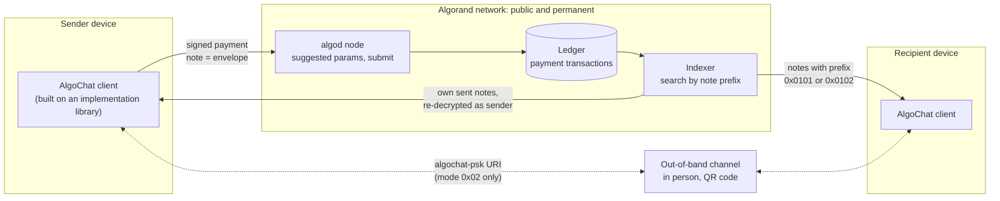

Sources: [PROTOCOL.md §10](../PROTOCOL.md#10-transport-layer), [§8.6](../PROTOCOL.md#86-psk-exchange), [IMPLEMENTATION.md](../IMPLEMENTATION.md) (Transaction Creation, Key Discovery).

### 2.2 This repository in the ecosystem

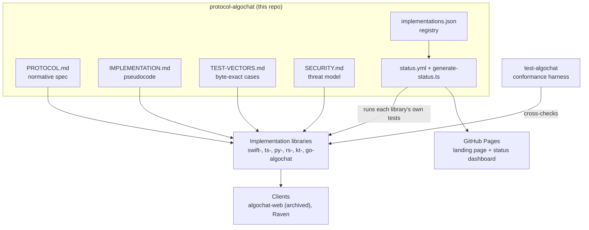

The implementation and client lists come from [README.md](../README.md) and [implementations.json](../implementations.json). The two lists differ slightly (see [§10](#10-open-questions-found-while-writing-this)).

## 3. Components

### 3.1 Protocol layers

The protocol is four thin, loosely coupled layers: protocol 1.2 added Falcon-1024 at the account layer without changing a single envelope byte ([PROTOCOL.md §14](../PROTOCOL.md#14-version-history)).

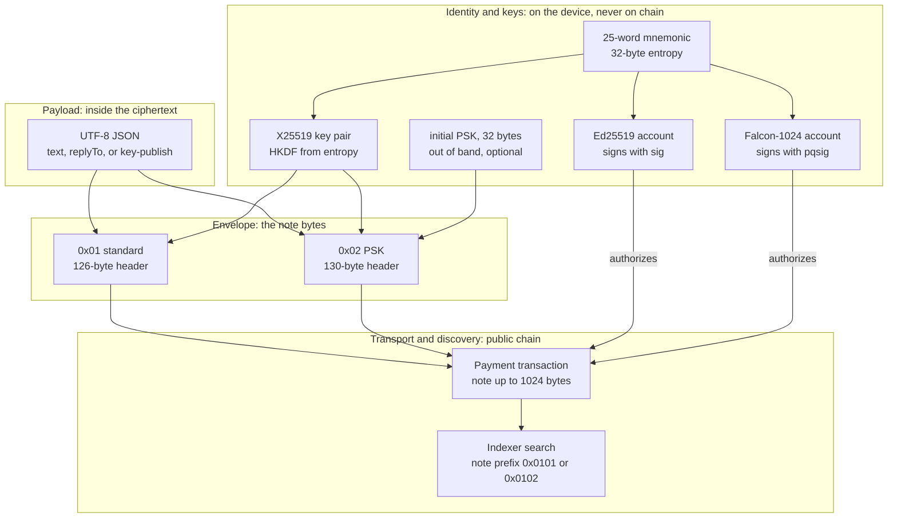

| Layer | What it owns | Spec |
| --- | --- | --- |
| Identity and keys | Mnemonic entropy, the long-term X25519 key pair, the Algorand account (Ed25519 or Falcon-1024), the optional PSK and its counter state | [§4](../PROTOCOL.md#4-key-derivation), [§8.6](../PROTOCOL.md#86-psk-exchange) |
| Payload | JSON message shapes: text, reply, key-publish | [§9](../PROTOCOL.md#9-message-payload) |
| Envelope | Byte layout, protocol id, per-message ephemeral key, nonce, sender key wrap, ciphertext | [§5](../PROTOCOL.md#5-envelope-format) to [§8](../PROTOCOL.md#8-psk-ratcheting-mode-protocol-0x02) |
| Transport and discovery | Payment fields, fees, note-prefix filtering, finding a peer's X25519 key | [§10](../PROTOCOL.md#10-transport-layer) |

### 3.2 Key derivation

One mnemonic feeds everything. The AlgoChat X25519 key comes from the 32-byte mnemonic entropy, so it is the same whether the account signs with Ed25519 or Falcon-1024. The same words give **different addresses** under the two schemes, but the **same** AlgoChat encryption keys ([PROTOCOL.md §4.1](../PROTOCOL.md#41-encryption-key-pair), [§4.3](../PROTOCOL.md#43-algorand-account-identity)).

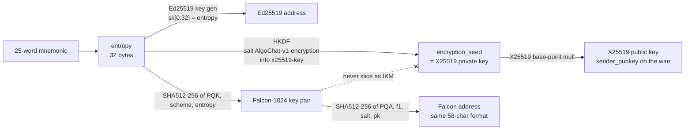

Rules that matter (all from [PROTOCOL.md §4](../PROTOCOL.md#4-key-derivation)):

- For an Ed25519 account the entropy equals `sk[0:32]`. For a Falcon-1024 account it is still the mnemonic entropy. Implementations **MUST NOT** take the first 32 bytes of a Falcon secret key as the IKM; that would silently fork every encryption key.
- Importing 25 words without naming a scheme **MUST** recover the Ed25519 address, so existing wallets do not silently move ([hi/account.md](../hi/account.md) `ACCOUNT-1.a`). Falcon on import must be explicit.
- An Ed25519 account MAY rekey its auth address to a Falcon address. The address stays the same; later payments must carry `pqsig` and pay the Falcon fee.
- The test vectors in [TEST-VECTORS.md §1](../TEST-VECTORS.md#1-key-derivation) feed 32-byte seeds; those seeds are mnemonic entropy.

### 3.3 Repository components

| Path | Owns |
| --- | --- |
| [PROTOCOL.md](../PROTOCOL.md) | The normative protocol, version 1.2 |
| [IMPLEMENTATION.md](../IMPLEMENTATION.md) | Language-neutral pseudocode, data structures, error names, PSK UX guidance |
| [TEST-VECTORS.md](../TEST-VECTORS.md) | Byte-exact vectors for key derivation, envelopes, round trips, PSK schedule, size limits |
| [SECURITY.md](../SECURITY.md) | Threat model, PSK threat matrix, key handling guidance, vulnerability reporting |
| [README.md](../README.md) | Overview, limits, economics, implementation list |
| [INTENT.md](../INTENT.md), [hi/](https://github.com/CorvidLabs/protocol-algochat/tree/main/hi) | Human intent: what the protocol should be, with permanent criterion ids |
| [implementations.json](../implementations.json) | Registry of implementations the status dashboard tests |
| [scripts/validate.ts](https://github.com/CorvidLabs/protocol-algochat/blob/main/scripts/validate.ts) | The `validate` task: the five protocol documents exist and are non-empty, registry ids are present and unique |
| [scripts/generate-status.ts](https://github.com/CorvidLabs/protocol-algochat/blob/main/scripts/generate-status.ts) | Builds `status.html` and `badges/*.svg` from per-implementation test results |
| [index.html](../index.html), [status.html](../status.html), [_config.yml](https://github.com/CorvidLabs/protocol-algochat/blob/main/_config.yml), [_includes/head-custom.html](https://github.com/CorvidLabs/protocol-algochat/blob/main/_includes/head-custom.html) | The GitHub Pages site: hand-written landing page, generated dashboard, Jekyll config, Mermaid rendering |
| [.github/workflows/status.yml](https://github.com/CorvidLabs/protocol-algochat/blob/main/.github/workflows/status.yml) | Daily implementation tests, dashboard generation, Pages deploy |
| [.github/workflows/trust.yml](https://github.com/CorvidLabs/protocol-algochat/blob/main/.github/workflows/trust.yml) | The CorvidLabs trust gate on every pull request and push to `main` |
| [fledge.toml](../fledge.toml), [.trust.toml](https://github.com/CorvidLabs/protocol-algochat/blob/main/.trust.toml), [.augur.toml](https://github.com/CorvidLabs/protocol-algochat/blob/main/.augur.toml), [.attest.json](https://github.com/CorvidLabs/protocol-algochat/blob/main/.attest.json), [.specsync/](https://github.com/CorvidLabs/protocol-algochat/tree/main/.specsync) | Task, lane and trust-gate configuration, and SpecSync change records |

## 4. Key flows

### 4.1 Find a peer's encryption key

To write to someone you need their X25519 public key. Every AlgoChat envelope carries its sender's key in clear, in the header, so any AlgoChat payment someone has sent reveals it, with no decryption needed. The pseudocode in [IMPLEMENTATION.md](../IMPLEMENTATION.md) (Key Discovery) searches the peer's sent payments for standard-mode notes first, then PSK-mode notes, and returns the first envelope that parses.

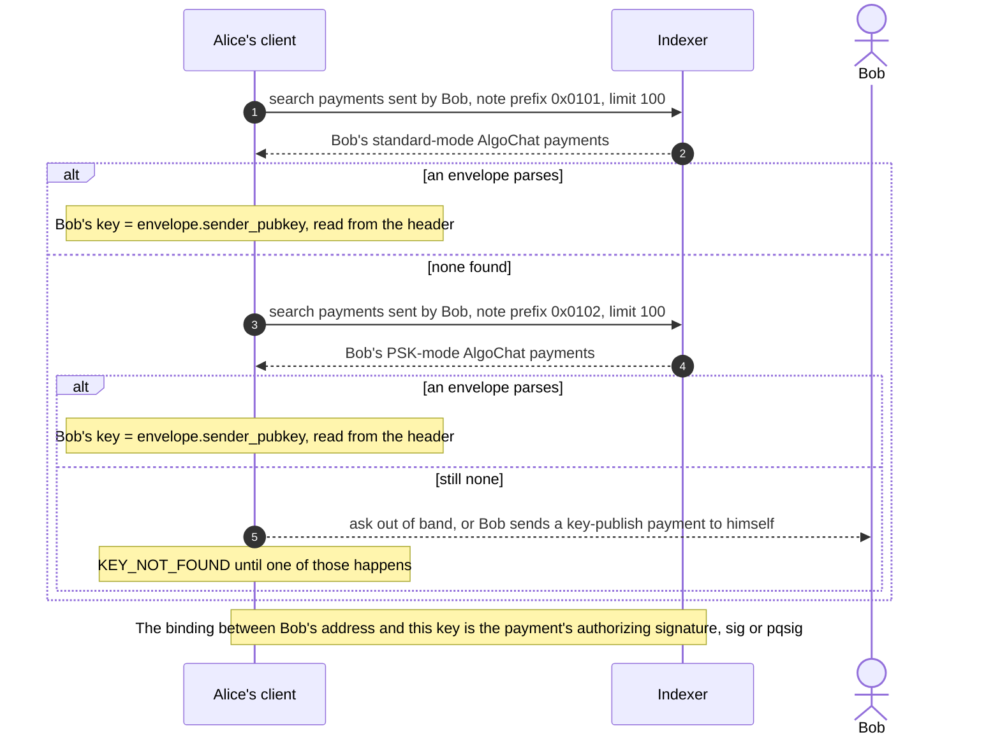

Three discovery methods are defined ([PROTOCOL.md §10.2](../PROTOCOL.md#102-key-discovery)): scan the recipient's sent transactions, look for a key-publish message the recipient sent to themselves, or exchange keys out of band. Only someone who can spend from an address can publish a payment from it, and that is what ties the X25519 key to the address. An extra Ed25519 signature over the X25519 key (the v1.1 announce format) is optional, only defined for Ed25519 addresses, and **MUST NOT** be required from Falcon-1024 senders.

### 4.2 Send a standard message (`0x01`)

Every message gets a fresh ephemeral X25519 key pair. The message key comes from ephemeral-to-recipient ECDH. The same message key is then wrapped for the sender under a second key from ephemeral-to-sender ECDH, which is what lets the sender re-read their own history from the chain on any device, without keeping plaintext ([PROTOCOL.md §2](../PROTOCOL.md#2-design-goals) goal 3, [§6](../PROTOCOL.md#6-encryption)).

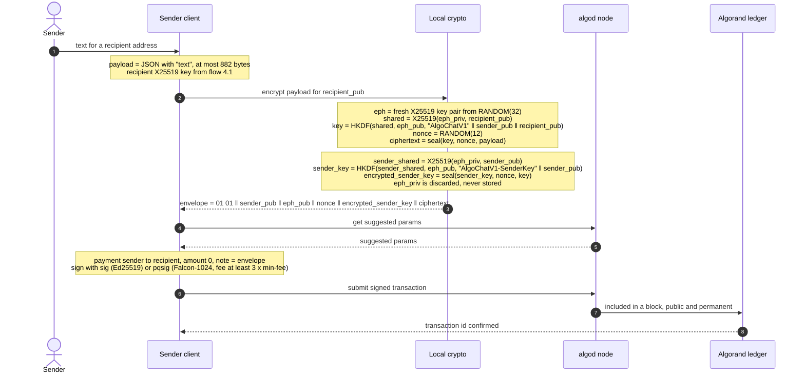

Points that trip implementers:

- One nonce is used twice, under two different keys: once for the message and once for the sender key wrap. That is how the spec defines it ([§6.2](../PROTOCOL.md#62-sender-key-encryption-self-decryption)), and the test vectors depend on it.
- The spec's `seal` calls pass no associated data. Header fields are bound indirectly: both public keys are in the HKDF `info`, the ephemeral key is the HKDF `salt`, and in PSK mode the counter selects the PSK. Changing any of them yields a different key and the tag check fails.
- The payment `amount` is independent of the protocol. The spec shows 0; the README notes any amount works, and §10.3 mentions 1,000 µAlgo as common.
- Test Case 3.1 in [TEST-VECTORS.md](../TEST-VECTORS.md#test-case-31-static-key-encryption) walks this whole flow with fixed keys and nonce, down to the 169-byte envelope.

### 4.3 Read a message, as recipient or as sender

A client reads its conversations back from the indexer, filtering by note prefix ([§10.3](../PROTOCOL.md#103-fees)). For each note it decides whether it is the sender or the recipient by comparing its own X25519 public key with `sender_pubkey` ([IMPLEMENTATION.md](../IMPLEMENTATION.md), Message Decryption).

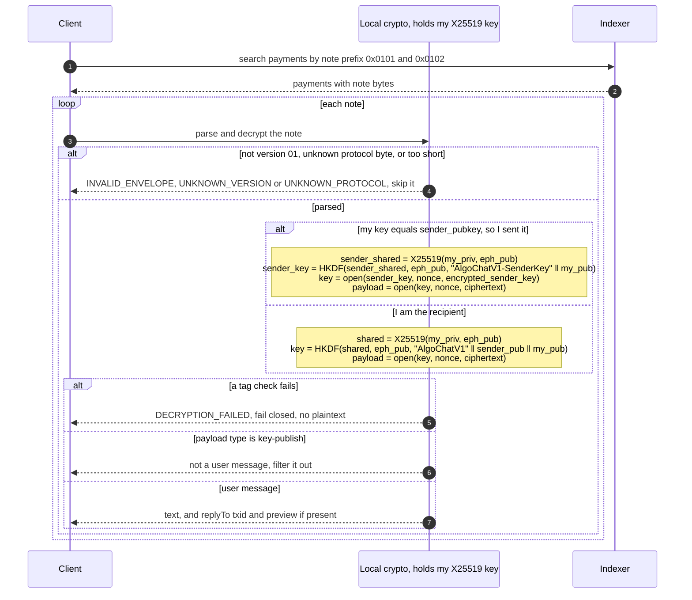

A flipped bit anywhere in the authenticated fields makes `open` fail, and the client must return nothing rather than partial plaintext ([hi/encrypt.md](../hi/encrypt.md) `ENCRYPT-1.a`). [SECURITY.md](../SECURITY.md#recommendations) asks for the same error for every authentication failure.

### 4.4 Set up a PSK and send in mode `0x02`

PSK mode mixes a pre-shared secret into every message key, so reading a message needs **both** an X25519 private key **and** the PSK ([hi/psk.md](../hi/psk.md) `PSK-1`, [PROTOCOL.md §8](../PROTOCOL.md#8-psk-ratcheting-mode-protocol-0x02)). Setup follows the flow in [IMPLEMENTATION.md](../IMPLEMENTATION.md) (UI/UX Guidance).

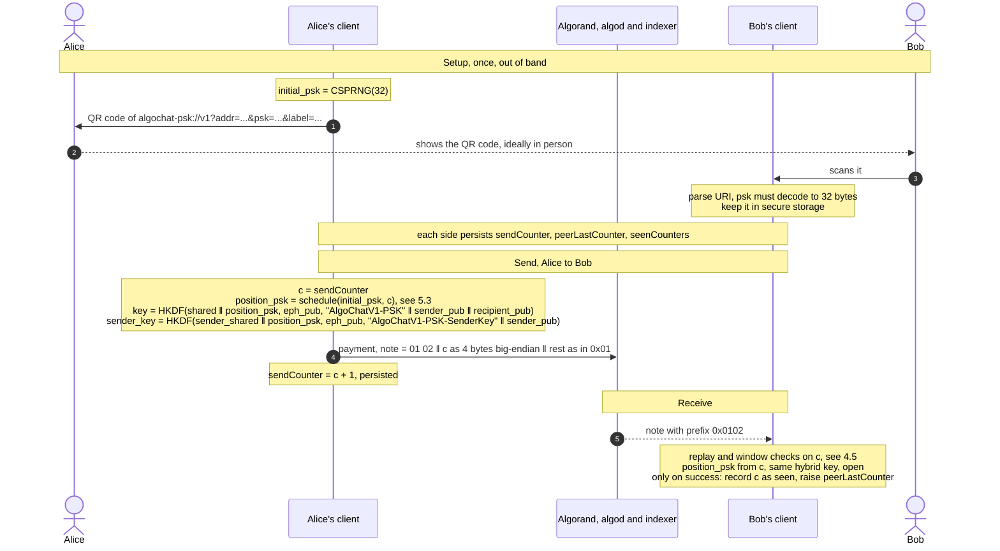

The sender reads its own PSK messages the same way as in 4.3, through `encrypted_sender_key`, and the counter checks apply only to messages received from the peer ([IMPLEMENTATION.md](../IMPLEMENTATION.md), PSK Message Decryption).

### 4.5 Accept or reject a PSK counter

Algorand can deliver notes out of order, so the receiver accepts any unseen counter inside a window around the highest counter seen so far ([PROTOCOL.md §8.5](../PROTOCOL.md#85-counter-window)).

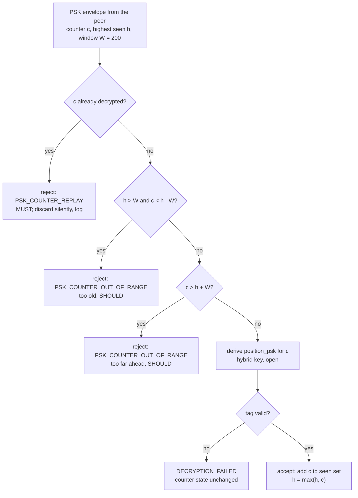

Test Case 4.4 in [TEST-VECTORS.md](../TEST-VECTORS.md#test-case-44-psk-counter-window) pins the edges: with `h = 50`, counters 0, 51 and 249 pass, 251 fails, and 50 fails if it was already decrypted.

### 4.6 Publish the status dashboard

This is the repository's own run-time flow. It keeps the public dashboard honest about which implementations pass their own tests.

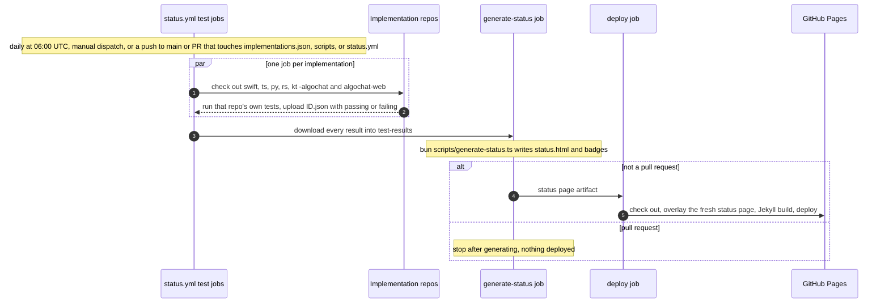

Each test job records a failure as data instead of failing, and the generate and deploy jobs run with `if: always()`, so a failing library shows up as failing on the dashboard rather than blocking the deploy. The `status.html` and `badges/` committed in the repo are snapshots; the deployed copies are regenerated on every run.

## 5. Data

### 5.1 Envelope byte layout

Offsets are from the deserializer in [IMPLEMENTATION.md](../IMPLEMENTATION.md) (Envelope Serialization). Ranges are half-open, `[start, end)`.

| Field | Standard `0x01` | PSK `0x02` | Size |
| --- | --- | --- | --- |
| `version` (always `0x01`) | `[0]` | `[0]` | 1 |
| `protocol` | `[1]` = `0x01` | `[1]` = `0x02` | 1 |
| `ratchet_counter`, big-endian u32 | not present | `[2, 6)` | 4 |
| `sender_pubkey`, X25519 | `[2, 34)` | `[6, 38)` | 32 |
| `ephemeral_pubkey`, X25519 | `[34, 66)` | `[38, 70)` | 32 |
| `nonce` | `[66, 78)` | `[70, 82)` | 12 |
| `encrypted_sender_key`, 32-byte key + 16-byte tag | `[78, 126)` | `[82, 130)` | 48 |
| `ciphertext`, payload + 16-byte tag | `[126, end)` | `[130, end)` | variable |

| Limit | Standard | PSK |
| --- | --- | --- |
| Header | 126 bytes | 130 bytes |
| Smallest valid envelope (empty payload, tag only) | 142 bytes | 146 bytes |
| Largest envelope (Algorand note limit) | 1024 bytes | 1024 bytes |
| Largest plaintext payload | 882 bytes | 878 bytes |
| Note prefix for indexer filtering | `0x0101` | `0x0102` |

### 5.2 Payload

The plaintext inside `ciphertext` is UTF-8 JSON ([PROTOCOL.md §9](../PROTOCOL.md#9-message-payload), [TEST-VECTORS.md §6](../TEST-VECTORS.md#6-message-payload-formats)):

| Shape | Fields | Client behaviour |
| --- | --- | --- |
| Text | `text` | Show it |
| Reply | `text`, `replyTo.txid`, `replyTo.preview` | Show it, linked to the earlier transaction |
| Key publish | `type: "key-publish"`, `publicKey` (base64) | Not a user message; filter it out |

The 882 and 878-byte limits apply to the encrypted plaintext, which is this JSON, so the usable text is somewhat shorter.

### 5.3 PSK key schedule

The "ratchet" is a deterministic two-stage schedule. Any counter's key can be computed directly from `initial_psk`, which is what makes out-of-order delivery work, and also why it is **not** forward secrecy ([PROTOCOL.md §8.1](../PROTOCOL.md#81-psk-ratchet-mechanism)).

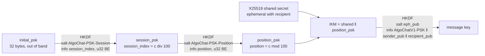

Leaking one `position_psk` exposes one message's PSK half; leaking a `session_psk` exposes up to 100; leaking `initial_psk` exposes every past and future PSK key for that pair. Test Cases 4.1 to 4.3 in [TEST-VECTORS.md](../TEST-VECTORS.md#4-psk-ratchet-derivation) pin the schedule and a full round trip.

### 5.4 Client-side state and on-chain objects

There is no database, smart contract or application state on chain. The chain stores only payment transactions; everything else lives on the client. The structures below are from [IMPLEMENTATION.md](../IMPLEMENTATION.md) (Data Structures, PSK Data Structures).

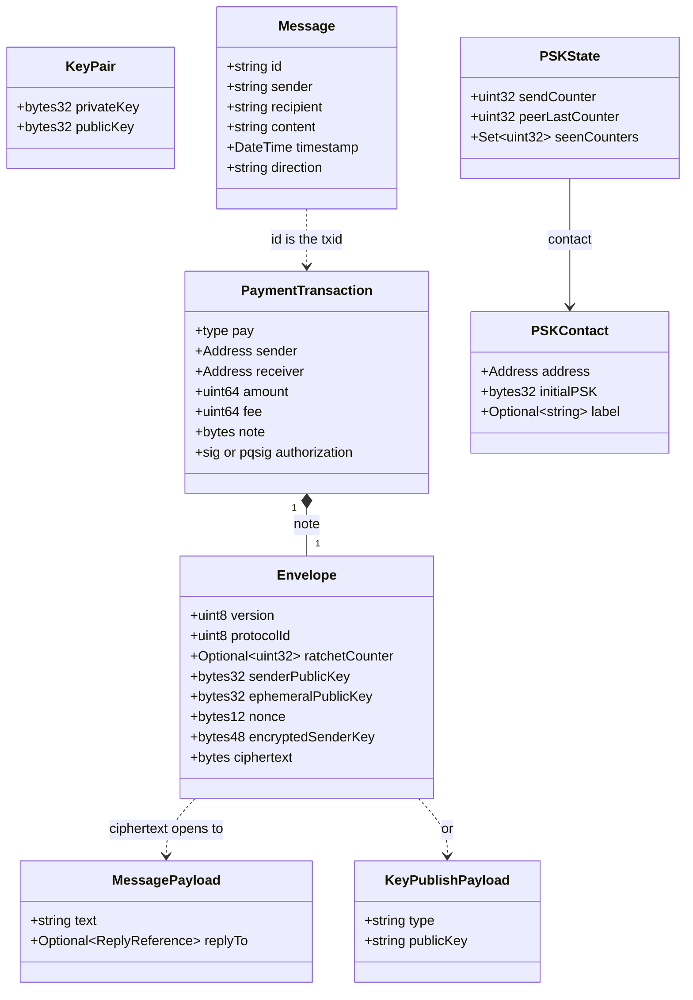

What must be kept, and where ([SECURITY.md](../SECURITY.md#key-management)):

- **Mnemonic and X25519 private key**: secure storage (secure enclave where available). The X25519 key can always be re-derived from the mnemonic.
- **`initial_psk`**: secure storage. It is the root of the whole PSK schedule.
- **PSK counter state** (`sendCounter`, `peerLastCounter`, `seenCounters`): **MUST** be persisted. Losing it weakens replay protection and can push counters outside the peer's window.
- **Plaintext**: need not be stored. Both sides can re-decrypt from the chain.
- **Ephemeral private keys**: never stored.

## 6. Runtime and deployment

This repository ships documents, not binaries. The "release" is a protocol version.

- **Versioning.** The version is stated at the top of [PROTOCOL.md](../PROTOCOL.md) and [TEST-VECTORS.md](../TEST-VECTORS.md) and tagged in git: `1.0.0`, `1.1.0` (added `0x02`), `1.2.0` (Falcon-1024 accounts, no envelope change). So far a new envelope format has meant a new protocol byte (`0x02` in 1.1), and existing envelope bytes and test vectors have stayed unchanged.
- **Local checks.** `fledge lanes run verify` runs the `validate` task (`bun scripts/validate.ts`). `fledge run intent` runs `hi check`. `fledge trust verify` runs the whole trust gate.
- **Trust gate in CI.** [trust.yml](https://github.com/CorvidLabs/protocol-algochat/blob/main/.github/workflows/trust.yml) runs on every pull request and every push to `main`, and `trust` is the required status check on `main`.
- **Status dashboard.** [status.yml](https://github.com/CorvidLabs/protocol-algochat/blob/main/.github/workflows/status.yml) runs as in [§4.6](#46-publish-the-status-dashboard).
- **GitHub Pages.** Pages is built by workflow. The deploy job in `status.yml` runs `actions/jekyll-build-pages` with [_config.yml](https://github.com/CorvidLabs/protocol-algochat/blob/main/_config.yml) (theme `jekyll-theme-midnight`, kramdown with GFM input). [index.html](../index.html) is a hand-written landing page; the Markdown documents, including this one, are rendered by Jekyll; `status.html` and the badges are regenerated each run. [_includes/head-custom.html](https://github.com/CorvidLabs/protocol-algochat/blob/main/_includes/head-custom.html) loads Mermaid on pages that contain diagrams. The public site is <https://corvidlabs.github.io/protocol-algochat/>. Because `status.yml` does not trigger on documentation-only pushes, a docs change goes live on the next daily run or a manual dispatch.
- **Atlas.** `trust.yml` has an Atlas publication path to Pages, switched off in [.trust.toml](https://github.com/CorvidLabs/protocol-algochat/blob/main/.trust.toml).

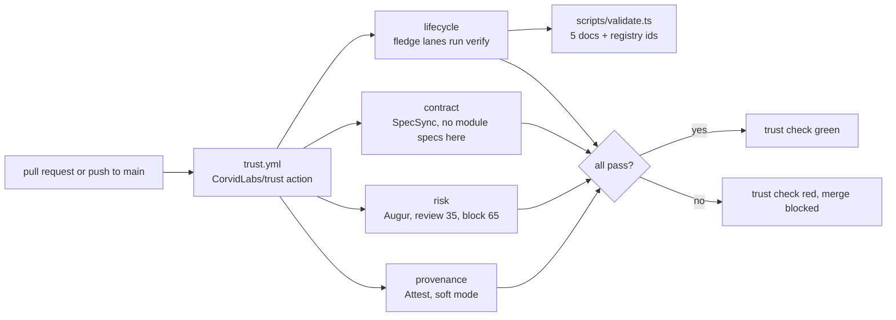

## 7. Security and trust boundaries

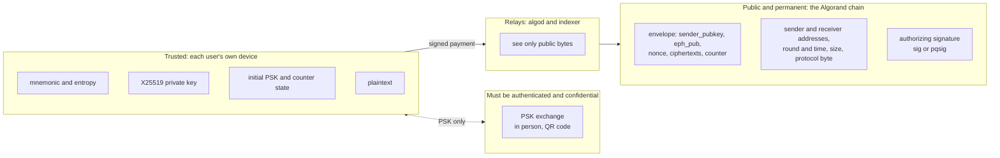

What is protected, and how:

| Property | Mechanism | Status |
| --- | --- | --- |
| Content confidentiality | X25519 ECDH per message, HKDF-SHA256, ChaCha20-Poly1305 | Protected ([hi/encrypt.md](../hi/encrypt.md) `ENCRYPT-1`) |
| Integrity | 16-byte Poly1305 tag on both ciphertexts; chain immutability | Protected, fails closed (`ENCRYPT-1.a`) |
| Replay | Transaction uniqueness on chain; PSK counter window and seen set | Protected |
| Who authorized the payment | Ed25519 `sig` or Falcon-1024 `pqsig` on the transaction | Protected; Falcon also resists quantum key recovery of the account |
| Quantum attack on the key exchange | PSK mixed into HKDF (`0x02`) | Defense in depth only; Falcon identity does **not** fix this ([hi/account.md](../hi/account.md) `ACCOUNT-2`) |
| Forward secrecy | None | **Not provided** ([§11.1](../PROTOCOL.md#111-forward-secrecy--not-provided), `HONEST-2`) |
| Metadata privacy, traffic analysis | None | **Not provided**: addresses, timing, size and mode are public (`HONEST-1`) |
| Deniability | None | **Not provided**: sender attribution is visible |

Things worth understanding before building on it:

- **No forward secrecy, retroactively and permanently.** The ephemeral key is the sender's, and its public half is in the envelope forever. Whoever later obtains either party's long-term X25519 key, or the mnemonic behind it, can decrypt every base-mode message that account ever sent or received. PSK-mode history additionally needs the PSK. Rotation cannot protect ciphertext that is already public ([PROTOCOL.md §11.1](../PROTOCOL.md#111-forward-secrecy--not-provided), [§11.4](../PROTOCOL.md#114-key-compromise)).
- **The sender's copy is separate.** Compromise of the recipient's key does not expose the sender's wrapped copy, and the other way round; each exposes that party's own history.
- **Sender authenticity comes from the payment, not the envelope.** The message key (§6.1) needs only the ephemeral private key and the recipient's public key, not the sender's long-term private key. What proves who sent a note is the transaction's authorizing signature, as [§10.2](../PROTOCOL.md#102-key-discovery) says, so the trustworthy "from" of a message is the transaction's sender address.
- **The PSK channel is the weak link in mode `0x02`.** If the PSK leaks during exchange, every PSK-derived key is exposed. Exchange in person or over an authenticated, confidential channel, and compare a fingerprint afterwards ([SECURITY.md](../SECURITY.md#for-users)).
- **Key handling.** Use audited libraries, a CSPRNG for ephemeral keys, nonces and PSKs, constant-time tag comparison, the same error for every authentication failure, and clear key material from memory after use ([SECURITY.md](../SECURITY.md#recommendations)).
- **Reporting.** Vulnerabilities go through a private GitHub Security Advisory, never a public issue ([SECURITY.md](../SECURITY.md#reporting-vulnerabilities)).

## 8. Failure modes and limits

| What goes wrong | Where it shows up | What happens |
| --- | --- | --- |
| Payload over 882 bytes (878 in PSK mode) | Encrypt | `MESSAGE_TOO_LARGE`; the protocol has no fragmentation, so the application must split |
| Envelope too short, wrong version, unknown protocol byte | Parse | `INVALID_ENVELOPE`, `UNKNOWN_VERSION`, `UNKNOWN_PROTOCOL`; the note is skipped |
| Tampered bytes, wrong key, wrong PSK or counter | Decrypt | `DECRYPTION_FAILED`; no plaintext is returned |
| Peer has never sent an AlgoChat payment and published no key | Discovery | `KEY_NOT_FOUND`; fall back to out of band |
| Falcon payment pays less than 3 x min-fee, or any submit error | Transport | Rejected by consensus; `TRANSACTION_FAILED` |
| No PSK stored for this contact | PSK send or receive | `PSK_NOT_FOUND`; prompt the user to set one up |
| Counter older or further ahead than the window | PSK receive | `PSK_COUNTER_OUT_OF_RANGE`; warn about desync, offer a counter reset |
| Counter already decrypted | PSK receive | `PSK_COUNTER_REPLAY`; discard silently, log for debugging |
| Lost counter state (reinstall, new device) | PSK send | Counters may land outside the peer's window; recover by manual reset or a new PSK |

Error names are from [IMPLEMENTATION.md](../IMPLEMENTATION.md) (Error Handling, UI/UX Guidance). Other limits, from [README.md](../README.md) and [SECURITY.md](../SECURITY.md#known-limitations):

- **Latency** is Algorand block finality, stated in the README as about 4.5 seconds.
- **Cost** is the network minimum fee per message: about 0.001 ALGO for Ed25519 and 0.003 ALGO for Falcon-1024 at a 1,000 µAlgo min-fee. AlgoChat sets no fee of its own.
- **No deletion.** Messages are permanent.
- **One to one only.** Groups need one encryption per member or a protocol extension.
- **Discovery depth.** The reference discovery searches at most 100 transactions per prefix and takes the first envelope that parses.
- **Dashboard.** An implementation whose tests fail is shown as failing; it does not stop the Pages deploy.

## 9. Decisions

The big choices, and where they are recorded:

| Decision | Why | Record |
| --- | --- | --- |
| The message is the note of a normal payment; no mailbox, contract or router | Delivery is the payment itself | [hi/send.md](../hi/send.md) `SEND-1`, [PROTOCOL.md §10.1](../PROTOCOL.md#101-algorand-transaction) |
| X25519 + HKDF-SHA256 + ChaCha20-Poly1305 | Widely audited primitives, the same family as Signal, WireGuard and TLS 1.3 | [PROTOCOL.md §3](../PROTOCOL.md#3-cryptographic-primitives), [README.md](../README.md#cryptographic-primitives) |
| A fresh ephemeral key per message plus a sender key wrap | Per-message key separation, and senders can re-read history from the chain on any device | [PROTOCOL.md §2](../PROTOCOL.md#2-design-goals), [§6.2](../PROTOCOL.md#62-sender-key-encryption-self-decryption) |
| Encryption keys derived from mnemonic entropy | Recoverable from the 25 words alone, and independent of the signing scheme | [PROTOCOL.md §4.1](../PROTOCOL.md#41-encryption-key-pair), [CHG-0002 design](https://github.com/CorvidLabs/protocol-algochat/blob/main/.specsync/archive/changes/2026-08-27-CHG-0002-falcon-account-identity/design.md) |
| PSK as a new protocol byte `0x02`, purely additive | Old envelopes and vectors stay valid | [PROTOCOL.md §5.4](../PROTOCOL.md#54-protocol-identifiers), [§8](../PROTOCOL.md#8-psk-ratcheting-mode-protocol-0x02), [hi/psk.md](../hi/psk.md) |
| Deterministic PSK key schedule with a 200-counter window | Works with out-of-order delivery; the price is no forward secrecy and a 100-message session blast radius | [PROTOCOL.md §8.1](../PROTOCOL.md#81-psk-ratchet-mechanism), [SECURITY.md](../SECURITY.md#psk-known-limitations) |
| Falcon-1024 lives only at the account layer; import defaults to Ed25519 | Quantum-resistant payment authorization without moving existing wallets or changing envelopes | [PROTOCOL.md §4.3](../PROTOCOL.md#43-algorand-account-identity), [hi/account.md](../hi/account.md), [CHG-0002](https://github.com/CorvidLabs/protocol-algochat/blob/main/.specsync/archive/changes/2026-08-27-CHG-0002-falcon-account-identity/change.md) |
| Envelopes stay within 1,024 bytes; hybrid PQ-KEM and PQ multisig are out of scope for 1.2 | Keep 1.2 small; a PQ-KEM envelope would be a later protocol id | [CHG-0002 design](https://github.com/CorvidLabs/protocol-algochat/blob/main/.specsync/archive/changes/2026-08-27-CHG-0002-falcon-account-identity/design.md) (Out of scope) |
| Say plainly that there is no forward secrecy | Honesty about what the chain keeps forever | [hi/honest.md](../hi/honest.md) `HONEST-2`, [PROTOCOL.md §11.1](../PROTOCOL.md#111-forward-secrecy--not-provided), [.specsync/changes/](https://github.com/CorvidLabs/protocol-algochat/tree/main/.specsync/changes) |

## 10. Open questions found while writing this

These are places where the documents disagree or are silent. None changes the wire format. They are listed so a reviewer can settle them in the spec.

- **Unknown: is `publicKey` required in a key-publish payload?** [PROTOCOL.md §9.3](../PROTOCOL.md#93-key-publish) includes it; [TEST-VECTORS.md Test Case 6.3](../TEST-VECTORS.md#test-case-63-key-publish-payload) uses `{"type":"key-publish"}` alone.
- **Unknown: minimum length check.** The reference deserializer accepts anything at least as long as the header (126 or 130 bytes); [TEST-VECTORS.md Test Case 2.2](../TEST-VECTORS.md#test-case-22-invalid-envelopes-standard-mode) says anything under 142 or 146 bytes (header plus tag) is invalid. Either way decryption of a tagless note fails; the question is which error is reported.
- **Unknown: order of PSK checks.** [PROTOCOL.md §8.4](../PROTOCOL.md#84-psk-decryption) checks replay before the window; the IMPLEMENTATION.md pseudocode checks the window first. Both reject; only the reported error differs.
- **Unknown: must a client check `sender_pubkey` against the transaction's sender address?** §10.2 names the payment signature as the binding, but no step in the decryption pseudocode compares the envelope's key with the key already known for `txn.sender`.
- **Registry and README differ.** The README lists `go-algochat` and marks `algochat-web` archived. `implementations.json` and `status.yml` do not include Go and still test `algochat-web` as `active-dev`.

## 11. Glossary

| Term | Meaning |
| --- | --- |
| algod | An Algorand node's API: suggested transaction parameters, transaction submission |
| Envelope | The AlgoChat bytes placed in a payment's `note` |
| Ephemeral key | A one-message X25519 key pair made by the sender; only its public half is kept, in the envelope |
| Encrypted sender key | The message key sealed for the sender, so the sender can re-read their own message |
| Indexer | Algorand's query service; AlgoChat uses it to search by note prefix |
| Key publish | A self-addressed AlgoChat payment whose payload is `type: "key-publish"`, so others can find the sender's X25519 key |
| Mnemonic entropy | The 32-byte secret behind a 25-word Algorand mnemonic; the IKM for AlgoChat keys |
| min-fee | Algorand's minimum transaction fee; PROTOCOL.md §10.3 prices at 1,000 µAlgo |
| Note | The free-form bytes field of an Algorand transaction, 1,024 bytes at most |
| `pqsig` | Algorand's native Falcon-1024 transaction signature, scheme `f1` |
| PSK | Pre-shared key: 32 random bytes two people share out of band for mode `0x02` |
| Ratchet counter | The 4-byte counter in a PSK envelope that picks the position key; a schedule index, not a Signal-style ratchet |
| Rekey | Pointing an Algorand address's spending authority at a different key, here Ed25519 to Falcon-1024 |
| Session and position PSK | The two stages of the PSK schedule: one key per 100 counters, then one per counter |
| `sig` | The classical Ed25519 transaction signature |
| µAlgo | One millionth of an ALGO |
